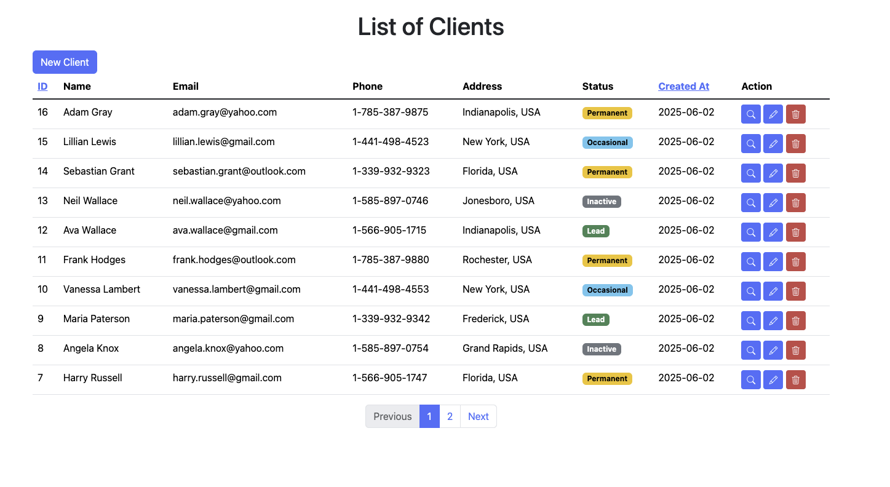

# CRM Client & Invoice Management



A simple CRM-style web application built with Spring Boot and Thymeleaf. It allows you to manage clients and their associated invoices through a clean web interface. The app supports CRUD operations for clients and invoices, along with pagination and sorting functionality.

## Features

- CRUD
- Invoice management per client (create/delete)
- Pagination (10 clients per page)
- Sorting by `id` and `createdAt`

## Technologies Used

- Java 21
- Spring Boot (Spring MVC, Spring Data JPA)
- PostgreSQL
- Thymeleaf (HTML templating engine)
- Bootstrap 5 (for styling)

### Run the App

1. Clone the repository:

```bash
git clone https://github.com/yourusername/springboot-crm-app.git
cd springboot-crm-app
